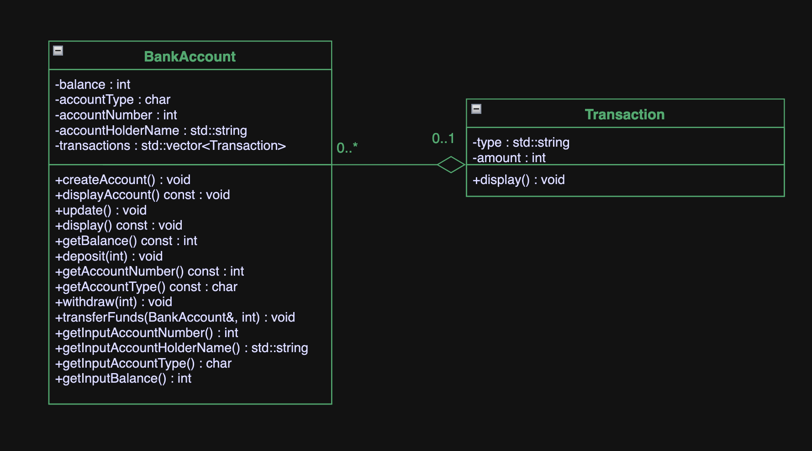

# Bank Account Management System

## Motivation


The realm of Fintech, with its intricate melding of finance and technology, has always been a profound area of interest for me. Having been interested in Revolut, Tinkoff, and other major financial technology representatives I developed interest in the area. During my tenure at Genify, a pioneering Fintech startup, I was exposed to the complexities and innovations that drive digital finance solutions. This rigorous internship not only deepened my understanding of the sector but underscored the significance of robust financial systems in today's digital age. Drawing from this experience and recognizing the pivotal role of efficient banking processes, I felt compelled to develop the Banking Account Management System. This venture was more than a mere project; it was a manifestation of my dedication to advancing the frontiers of Fintech.

## Introduction

The Bank Account Management System is a command-line application that offers functionalities like creating a new bank account, depositing funds, withdrawing funds, transferring funds between accounts, and more. This report delves into the underlying implementation and the rationale behind various decisions made during the coding of this application.

## Approach

### Object-Oriented Design

The system was designed keeping object-oriented programming (OOP) principles in mind, with two primary classes: `Transaction` and `BankAccount`.

- **Transaction Class**: Represents a single bank transaction.
    ```cpp
    class Transaction {
    private:
        std::string type;
        int amount;
        //...
    };
    ```
    
- **BankAccount Class**: Represents a bank account, holding details of the account holder, balance, account type, and a list of transactions.
    ```cpp
    class BankAccount {
    private:
        int balance;
        //...
        std::vector<Transaction> transactions;
        //...
    };
    ```

### Handling User Input

One of the main challenges was to ensure valid input from the user. Robust error checking mechanisms were used to ensure that the input conforms to the expected format or value.

For instance, when obtaining the account holder's name, we ensure it doesn't contain numbers:
```cpp
std::string BankAccount::getInputAccountHolderName() {
    //...
    if (name.find_first_of("0123456789") == std::string::npos) {
        return name;
    }
    //...
}
```
### Account Creation and Management

The `BankAccount` class provides methods for creating an account, updating account information, depositing, withdrawing, and transferring funds. Each of these methods encapsulates the logic required for the respective operation.

- **Creating an Account**: The `createAccount` method takes user input for account details and initializes a new account.
    ```cpp
    void BankAccount::createAccount() {
        //...
    }
    ```

- **Updating Account Information**: The `update` method allows users to update account information, such as the account holder's name and account type.
    ```cpp
    void BankAccount::update() {
        //...
    }
    ```

- **Depositing and Withdrawing Funds**: The `deposit` and `withdraw` methods handle transactions within an account, ensuring that the balance is updated correctly and adding the transaction details.
    ```cpp
    void BankAccount::deposit(int amount) {
        //...
    }

    void BankAccount::withdraw(int amount) {
        //...
    }
    ```

- **Transferring Funds**: The `transferFunds` method facilitates transferring funds between two accounts while maintaining transaction records for both.
    ```cpp
    void BankAccount::transferFunds(BankAccount& recipient, int amount) {
        //...
    }
    ```

### Account Vector and Search

Accounts are stored in a vector of `BankAccount` objects. To find a specific account, the `findAccount` function iterates through the vector and returns a pointer to the account if found.

```cpp
BankAccount* findAccount(int accNo) {
    //...
}
```

### Flow and Main Functionalities

 - **Main Menu**: The main function acts as the driver, presenting a menu with various options and calling the respective functions based on the user's choice.

- **Adding Accounts**: The system allows for creating new accounts and stores them in a global `std::vector<BankAccount> accounts`.

- **Transaction Handling**: The system supports deposits, withdrawals, and transfers. Each of these transactions gets recorded in the respective account's transaction history.

For example, during a deposit:

```cpp
void BankAccount::deposit(int amount) {
    if (amount > 0) {
        balance += amount;
        transactions.emplace_back("Deposit", amount);
        //...
    }
}
```
- **Data Presentation**: Users can view all account holders' information and individual account details, which also includes their transaction history.
  
### UML Diagram

 

### Optimizations and Best Practices

- **Use of `emplace_back`**: Instead of pushing traditionally constructed objects into the vector, the system utilizes the emplace_back method. This constructs the object in place, which can be more efficient as it avoids temporary object creation.

```cpp
transactions.emplace_back("Deposit", amount);
```

- **Search Optimization**: When finding an account by its account number, the system linearly searches the accounts vector. This might not be the most efficient approach for large datasets but is suitable for the scale of this application.

```cpp
for (auto& acc : accounts) {
    if (acc.getAccountNumber() == accNo) {
        return &acc;
    }
}
```

- **Safety with Pointers**: The system uses raw pointers at some places, notably when fetching an account by number. It's essential to ensure that these pointers are always used safely and that they never outlive the objects they point to.


## Conclusion

The Bank Account Management System offers a simplified simulation of how banking systems manage and record transactions. While the system serves its primary purpose, there are areas for improvement, such as the use of databases for persistent storage, enhancing the search algorithm, and migrating to smart pointers for safer memory management.


## References

- https://www.geeksforgeeks.org/vector-in-cpp-stl/

- https://www.geeksforgeeks.org/clear-console-c-language/

- https://app.diagrams.net/

- https://www.geeksforgeeks.org/cpp-pointers/?ref=shm

- https://www.ibm.com/cloud/architecture/architectures/banking/reference-architecture/
